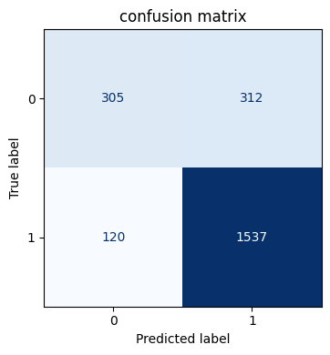
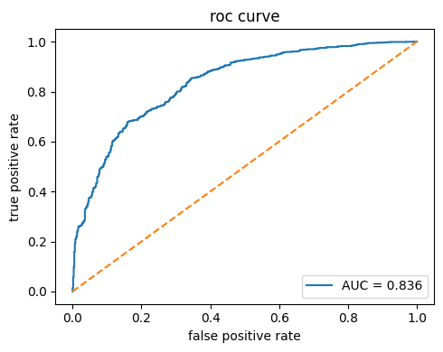

# Amazon Fashion Sales – Predictive Model

## Project Goal
[Full Business Summary (PDF)](04_amazon_predictive_model_business_summary.pdf)

This project builds a logistic regression model to identify which product features most strongly drive high customer ratings on Amazon Fashion.

---

## Key Findings
- Category and brand have the strongest influence on whether a product is highly rated.
- Price shows minimal direct impact on ratings.

---

## Business Recommendations
- Focus on top-rated categories – e.g., “Sportswear” – to maximize sales potential.
- Avoid pricing assumptions – Higher or lower prices do not directly translate to more product sales.

---

## Model Visualizations

| Visualization | Description |
|---------------|------------|
|  | Shows a majority of true positives, illustrating the model’s accuracy. |
|  | Displays strong model performance with an AUC of 0.836. |

---

## Tools Used
- **Languages & Libraries** – Python, pandas, numpy, scikit-learn, matplotlib  
- **Environment** – Google Colab  
- **Notebook** – [Full Predictive Model Workflow](notebooks/03_amazon_sales_products_predictive_model.ipynb)
  
---

## Next Steps
- **Track key KPIs** – Category growth rates, review volumes, and price–rating relationships.  
- **Benchmark other platforms** – Extend analysis to other e-commerce sites to compare category and product performance.

